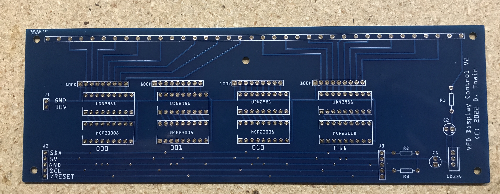
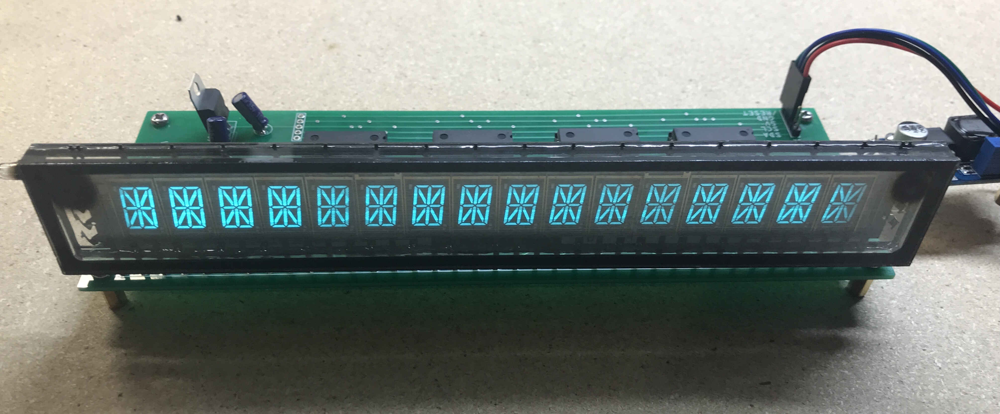

# VFD Display Project

Some notes on building a display driver for a Futaba 16-LY-01ZL alphanumeric display.
It seems that Futaba no longer manufactures or supports these devices, but they are
commonly available for secondhand purchase.  The device has 37 pins at 0.2in spacing.


This is a vacuum flourescent display (VFD), which is a variant of the vacuum tube.
A small AC current is used to heat a filament (cathode) when then produces electrons
via thermionic emission.  The electrons are naturally attracted to anodes, if they
are positively charged.  Each anode is coated with a flourescent material, and glows
a distinctive amber/green color when active.  Between the cathode and anode is a grid
that controls whether the electrons flow.

This particular one is a sixteen digit alphanumeric display.  Each digit has sixteen
segments, plus three more indicators: a dot in the upper left corner (Q) and
a decimal (R) and comma (S) in the lower right corner.  Each segment corresponds
to one anode, and each digit is controlled by a separate grid.  As a result, the
display can be multiplexed much like a multi-digit LED display.

```
.             S
 --- ---         HHH GGG
|\  |  /|       AI  N  LF
| \ | / |       A I N L F
 --- ---         PPP OOO
| / | \ |       B J M K E
|/  |  \|       BJ  M  KE
 --- ---         CCC DDD
         .               Q 
          /                R
```

## Datasheets and Testing

No datasheet is available for the device itself, however, it is mentioned in [this datasheet](datasheets/TDK-CD1867N.pdf) for DC/AC inverters,
which provides some key parameters:

|Converter | Ef r.m.s Vac | If (mAac) | V1 (Vdc) | V2 (Vdc) | I1 (mAdc) max. | I2 (mAdc) max. | Display |
|---|---|---|---|---|---|---|---|
|CD-1884N | 7.2 | 75 | -47 | -58 | 20.4 | 7.5 | 16-LY-01ZL |
|CD-1884P | 7.2 | 75 | 58 | - | 29.9 | -| 16-LY-01ZL |

There are two power supply variants here: the N variant sets both the cathode and anodes well below ground, while the P variant sets the cathode at ground (+/- the small AC voltage) and the anodes and grids at 58V.  Ef is the AC voltage applied to the filament to generate electrons, and V1 is the potential difference between cathode and anodes.

We can test the pinouts quickly by using some lower voltages that are easily available with components on hand.  Handily, the connections for the filament (either end) and grids are easily visible through the glass, while the anode connections are printed on the back of the device.  Test by applying 3.3V DC to the filament pins, and then using +30VDC to the grids and anodes to light up various segments:

Pin | Type | Number
---|---|---
1 | Filament | X 
2 | Anode | I
3 | Grid | 1
4 | Anode | S
5 | Grid | 2
6 | Anode | J
7 | Grid | 3
8 | Anode | K
9 | Grid | 4
10 | Anode | L
11 | Grid | 5
12 | Anode | M
13 | Anode | N
14 | Grid | 6
15 | Anode | O
16 | Grid | 7
17 | Anode | P
18 | Grid | 8
19 | Anode | Q
20 | Grid | 9
21 | Anode | R
22 | Grid | 10
23 | Anode | A
24 | Grid | 11
25 | Anode| B
26 | Anode | C
27 | Grid | 12
28 | Anode | D
29 | Grid | 13
30 | Anode | E
31 | Grid | 14
32 | Anode | F
33 | Grid | 15
34 | Anode | G
35 | Grid | 16
36 | Anode | H
37 | Filament | Y

## Block Diagram

There are 35 lines to be controlled.  If we leave out the dot, decimal, and comma,
then we need 32 GPIO lines in order to control 16 grids and 16 anodes.
The MCP23008 gives us eight I/O lines controllable via I2C,
and matches up nicely with an eight-way power driver (UDN2981) and eight-way
resistor bus that switch the 30V power.  Four of each of those can be stacked on an I2C bus as follows:

```
              -> 5V Power -> LD33V -> 3.3V -> Filament
                     |
MCU -> I2C -> | -> MCP23008 => UDN2981 => Pulldowns => 8 Grids  (bank 0)
              | -> MCP23008 => UDN2981 => Pulldowns => 8 Anodes (bank 1)
              | -> MCP23008 => UDN2981 => Pulldowns => 8 Anodes (bank 2)
              | -> MCP23008 => UDN2981 => Pulldowns => 8 Grids  (bank 3)
                                  |
                              30V Power
```

## Circuit Board

[Fritzing PCB File](vfd-display.fzz)


## Bill of Materials

| Quantity | Part | Description| Datasheet | Source
|---|---|---|---|---|
| 1 | 16-LY-01ZL | Futaba 16-Digit Alphanumeric  VFD | none | eBay
| 4 | UDN2981 | High-Side Power Drivers(x8) | [datasheet](datasheets/udn2981.pdf) | (find on ebay)
| 4 | MCP23008 | I2C I/O Expander (x8) | [datasheet](datasheets/mcp23008.pdf) | [digikey](https://www.digikey.com/en/products/detail/microchip-technology/MCP23008-E-P/735951)
| 4 | 4609X-AP1-103LF | 100K Resistor Array | | [digikey](https://www.digikey.com/en/products/detail/bourns-inc/4609X-101-104LF/3593673)
| 1 | LD1117V33 | 3.3V Linear Regulator | [datasheet](datasheets/ld1117.pdf) | [digikey](https://www.digikey.com/en/products/detail/stmicroelectronics/LD1117V33/586012)
| 2 | ECA-1VM-100 | 10uF Electrolytic Capacitor | | [digikey](https://www.digikey.com/en/products/detail/panasonic-electronic-components/ECA-1VM100/245020)

## Build

Here is the board fresh from JLCPCB:



Here is the board populated with parts and the display.  (Note that the display faces away from the board.)


And here is the board powered up for the first time, showing all segments on.
Note that there is some variation in brightness across the digits.
This is because I am using DC across the filament, which results in some voltage
drop from one end to the other:



## Principle of Operation

For the convenience of board layout, note that the MCP23008 outputs are in reverse
order from the transistor array, so we end up with the following correspondence between
output registers and display pins:

| Bank   | I2C Addr | 7 | 6 | 5 | 4 | 3 | 2 | 1 | 0 |
|--------|----------|---|---|---|---|---|---|---|---|
| Bank 0 | 0x20 | G9 | G10 | G11 | G12 | G13 | G14 | G15 | G16 |
| Bank 1 | 0x21 | I | J | K | L | M | N | O | P |
| Bank 2 | 0x22 | A | B | C | D | E | F | G | H |
| Bank 3 | 0x23 | G1 | G2 | G3 | G4 | G5 | G6 | G7 | G8 |

Note that the logic is inverted: high logic values cause the grids/anodes
to be grounded while low logic values light things up.

To display a single character, we must send the appropriate bit pattern
to banks 1/2, and then enable one character by setting one bit low in
banks 0/4.  Each digit must be shown in turn at a rate of about 100Hz.

## Working Code

Coming soon...

